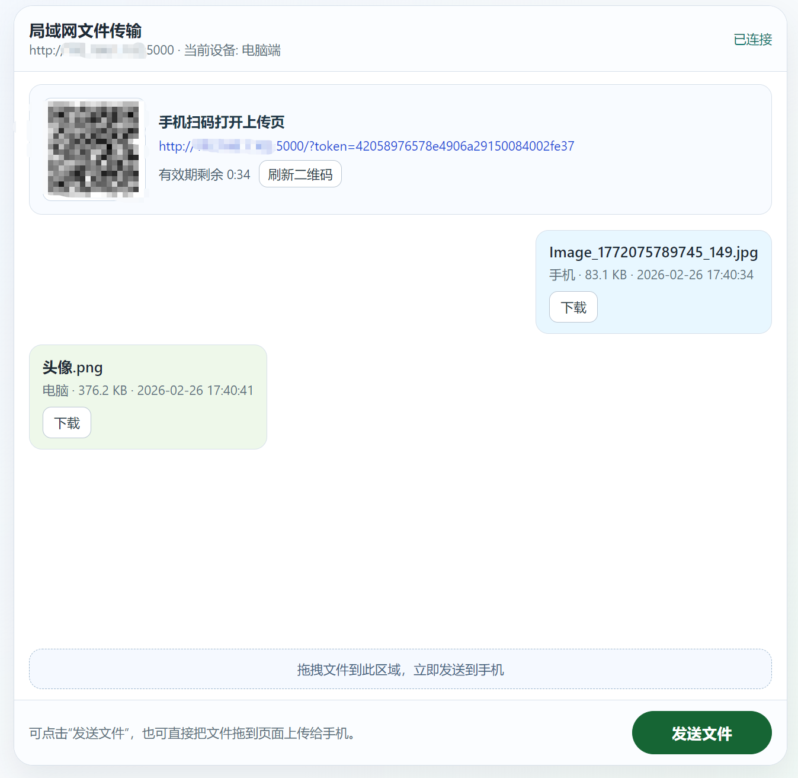

# LAN 文件传输系统（Flask + Web）

无需安装手机 App，手机扫码后用浏览器即可与电脑互传文件。

## 功能

- 局域网文件互传（手机 <-> 电脑）。
- 启动后自动打开电脑端网页，网页内直接显示手机扫码二维码。
- 终端模式可打印 ASCII 二维码；托盘模式可常驻后台。
- 聊天风格传输记录列表，支持下载历史文件。
- 电脑端支持拖拽上传；手机端收到电脑文件可一键下载。
- 使用 WebSocket 实时同步记录，前后台切换时保持心跳。

## 开发运行

```bash
python -m venv .venv
.venv\Scripts\activate
pip install -r requirements.txt
python app.py --port 5000
```

常用参数：

```bash
python app.py --port 5000 --save-dir received_files
python app.py --no-browser
python app.py --no-terminal-qr
```

## 托盘运行（源码模式）

```bash
python tray_app.py --port 5000
```

托盘菜单支持：

- 打开传输页面
- 重启服务
- 退出
- 重复启动保护：如果程序已在运行，第二次启动会弹窗提示并直接打开已有页面

## 方案 1：打包 EXE

```powershell
.\build\build_exe.ps1
```

产物：

- `dist\LANFileTransfer.exe`（托盘化、双击即用）

## 方案 2：安装器（Inno Setup）

先安装 Inno Setup 6，然后执行：

```powershell
.\build\build_installer.ps1
```

产物：

- `dist\LANFileTransfer-Setup.exe`

安装器功能：

- 安装到 `AppData\Local\Programs\LAN 文件传输`
- 开始菜单快捷方式
- 可选桌面快捷方式
- 可选开机启动

## 方案 3：EXE + 安装器 + 托盘化

本仓库已完整支持该组合方案：

1. `build_exe.ps1` 生成托盘 EXE
2. `build_installer.ps1` 打包安装器
3. 用户安装后通过快捷方式启动，程序常驻托盘

## 大文件内存占用处理

上传接口按块写盘（默认 1MB/chunk），避免整文件驻留内存；下载使用 `send_file(..., conditional=True)`，支持流式/分段请求，减少内存压力。

## 界面截图




